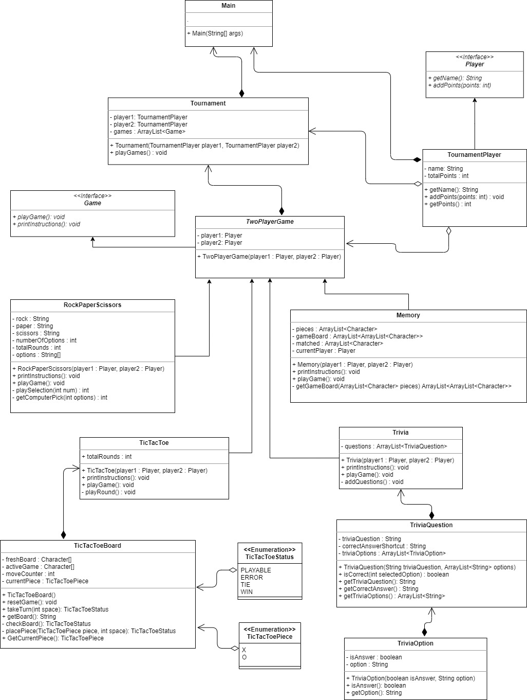

## Name: user7455602 - Julia C.

This is my Mini game tournament I developed for the final culmination project for grade 12 Java. Two players compete in each game for points and the final score is shown at the end of the tournament.

**Games List:**

1. Rock Paper Scissors *(modified from my project 1)
1. Memory *(modified from my project 2)
1. TicTacToe *(modified from my Project 3)
1. Trivia (all new)
   
\* These games were modified for 2 player and some (Rock paper scissors & Memory) were also made into classes. TicTacToe was already class based.

## Updated UML:

   
